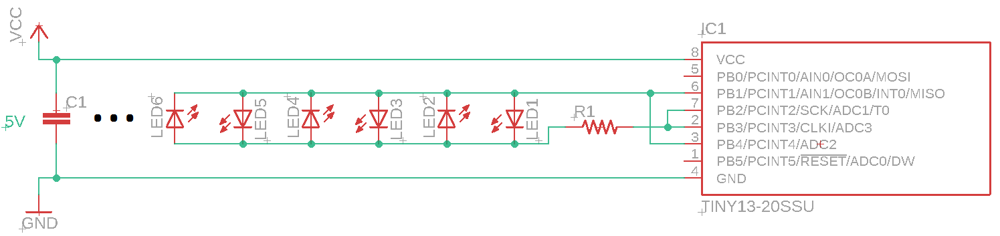

# ATtiny13 controlled Christmas LED string

## Features
* Uses a Charlieplexing technique to control 2 groups of LEDs using 2 wires
* Auto mode
* Static mode
* 9 blinking modes with 3 different speeds
* 10 to 30 LEDs support
* To switch to the next speed or mode, just power off and power on the MCU 1-2 times
* Current speed and mode are automatically locked after 30-60 seconds

## Circuit diagram

* C1: 0.1 to 1uF
* R1: 10 to 20 uF

## Flashing

`-Ulfuse:w:0x79:m -Uhfuse:w:0xFD:m`